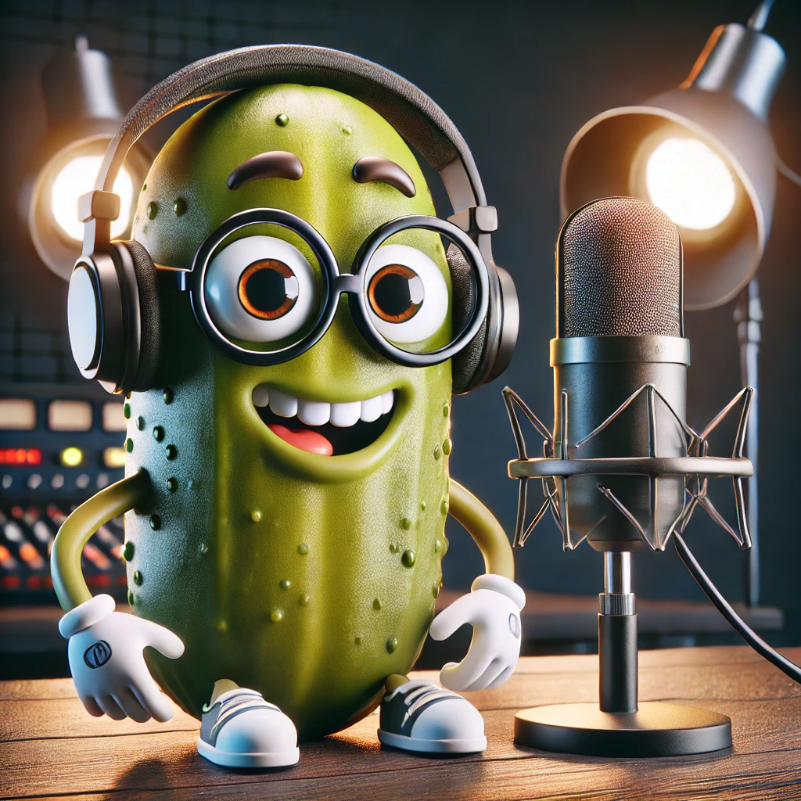

  
  </a>

<h1 align="center">
   👇 Podcast Pickle Code 👇
</h1>

## 📒 Descrição
Projeto com o objetivo de explorar ferramentas de IA Generativas criando um conteúdo que seja o mais natural possível.

## 🤖 Tecnologias Utilizadas
- [ChatGPT](https://chat.openai.com/) 
- [ElevenLabs](https://beta.elevenlabs.io/)
- [Capcut](https://www.capcut.com/pt-br/)

## 🧐 Processo de Criação
- Roteiro gerado via chatgpt
- Audio gerado pela elevenLabs
- Chatgpt Para gerar capas
- Capcut para tratar aúdio e adicionar sons de fundo

## 🚀 Resultados

    <audio controls>
  <source src="./outputs/audios/Episódio 01 Desvendando as Sombras do CSS e Explo.MP3" type="audio/mpeg">
</audio>

## 👨‍💻 Dev

    
    
&nbsp&nbsp&nbspVanessa Sousa Pro 
    &nbsp&nbsp&nbsp
    <a 
        href="https://github.com/vanessasousapro">
        GitHub
    </a>
    &nbsp;|&nbsp;
    <a 
        href="https://www.linkedin.com/in/vanessa-sousa-pro/">
        LinkedIn
    </a>

  

---

⌨️ com 💜 por [Vanessa Sousa Pro](https://github.com/vanessasousapro)
